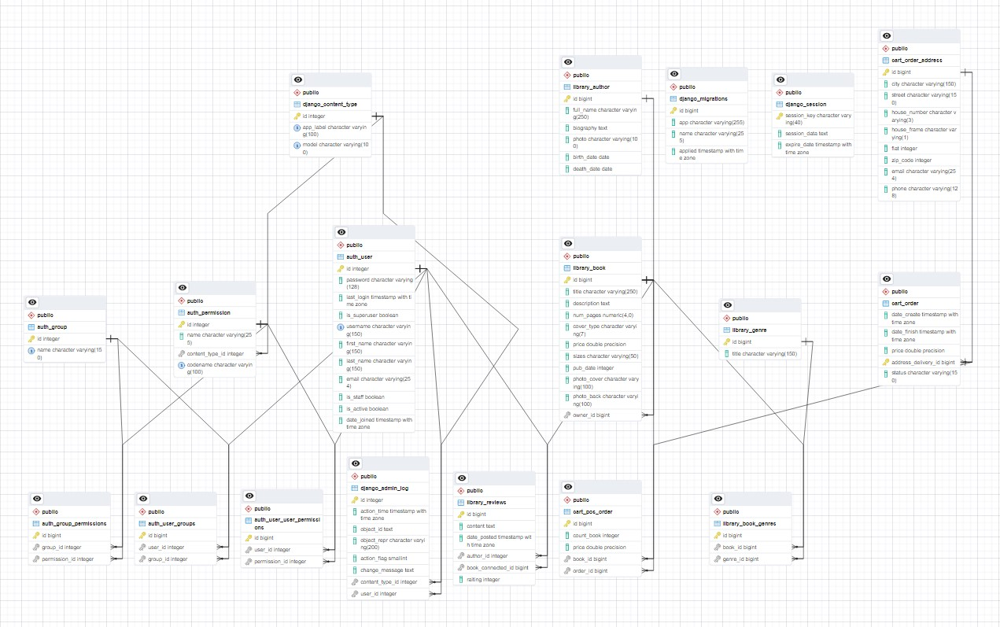

# django_bookstore
Final certification work on the course backend - development on the Django framework. This project can be used as a template for the development of online stores or e-commerce sites.

## Project Description

### Subject area
The project is an online version of a modern bookstore, where the user can easily access the full list of books, view detailed information about the book, the author. Thanks to the implemented system of filtering books by genre and searching by title, author or content, it will not be difficult to find the right content. With the help of feedback, the user will always be able to quickly receive answers from the administration to questions of interest, and the system of book reviews and rating based on opinion users will make the choice even easier. The application implements an API for easy integration with various services and the possibility of scaling in the future.

### The application has created:
- a model of books with the following attributes: title, description, number of pages, price, cover type, dimensions, publication date, cover photo.
- model of authors with the following attributes: full name of the author, biography (a little background information), portrait of the author, date of birth, date of death
- added admin panel
- implemented sending feedback letters
- added redefinition of errors 400, 403, 404, 500
- static files and styles are connected
- API implemented
- added forms and output classes (ListView, DetailView, CreateView, UpdateView, DeleteView). Pagination has been added to the output of books and authors
- registration and authorization of users has been implemented, rights to appropriate actions have been established
- search by book title, author, description. Filtering books by genre
- feedback system with the ability to rate the book
- calculation of the average rating based on reviews of the book
- service page for store employees
- online store shopping cart with checkout
- sending an html email with order confirmation to the client's email

### ER model

